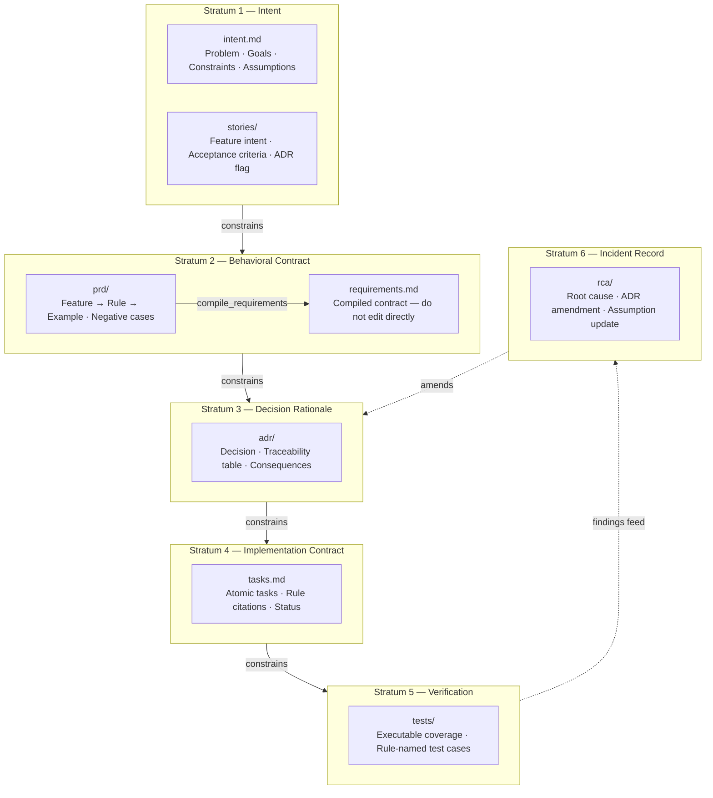
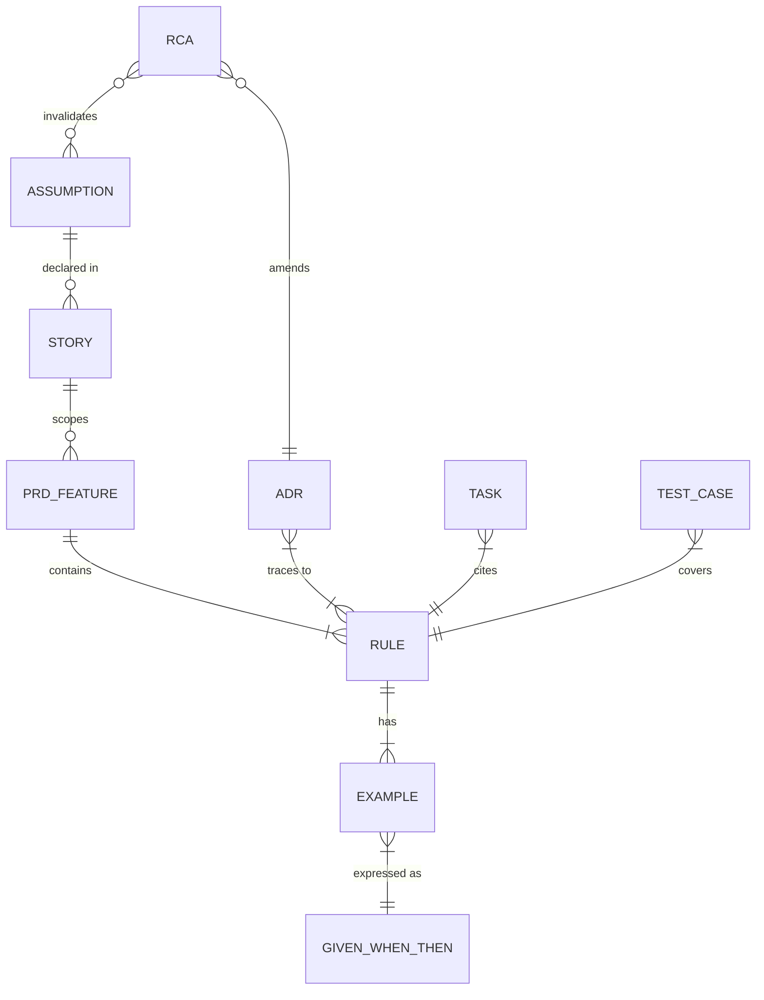
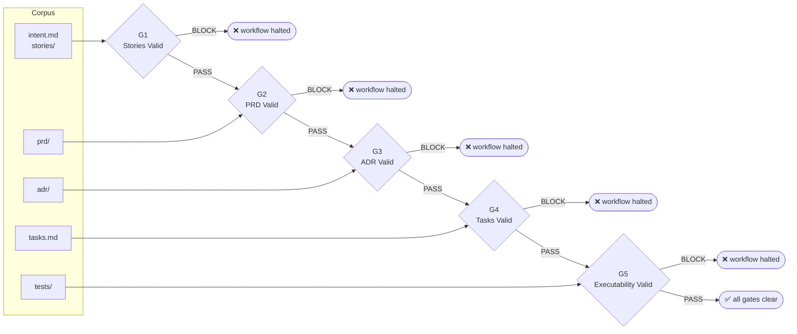
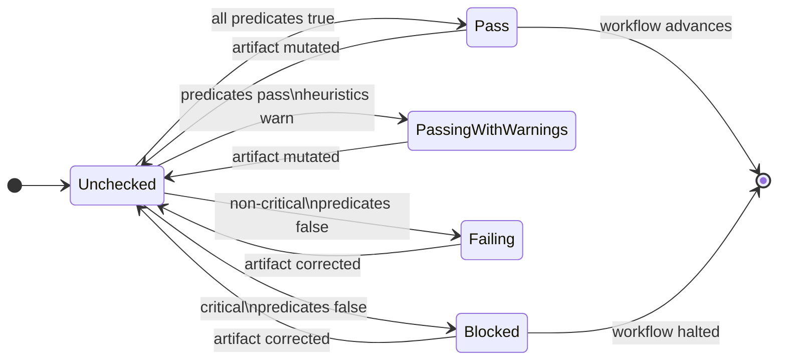
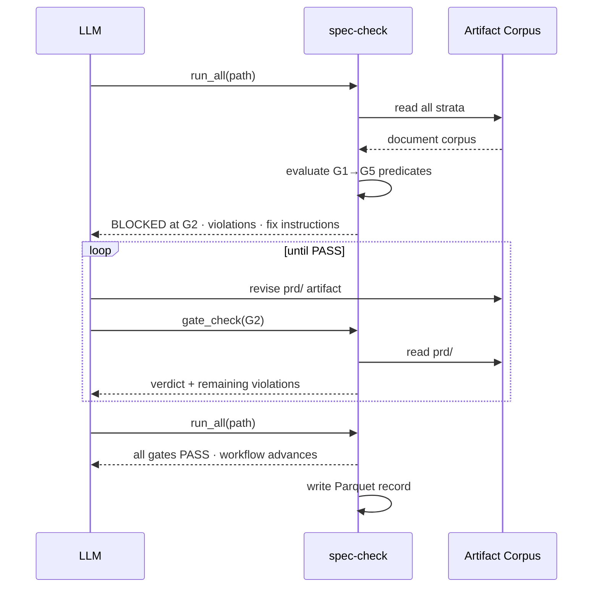
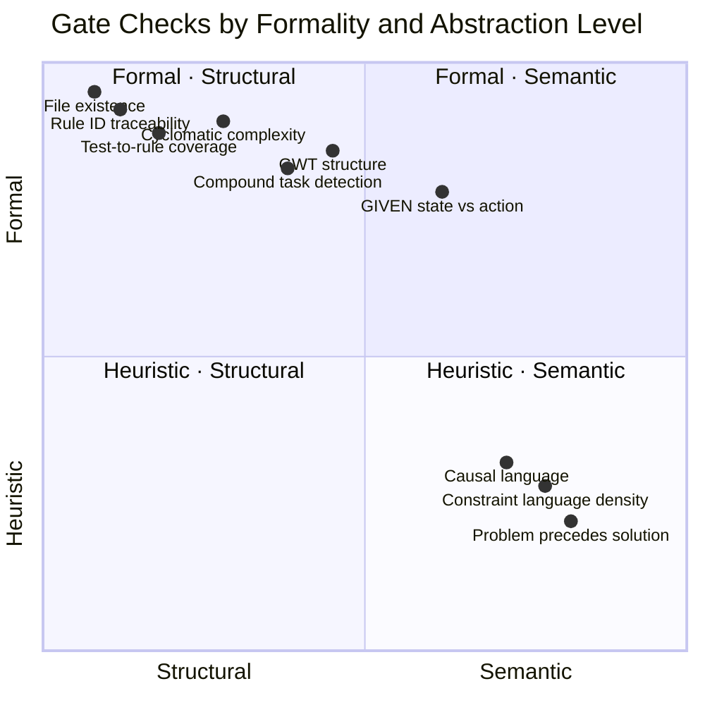
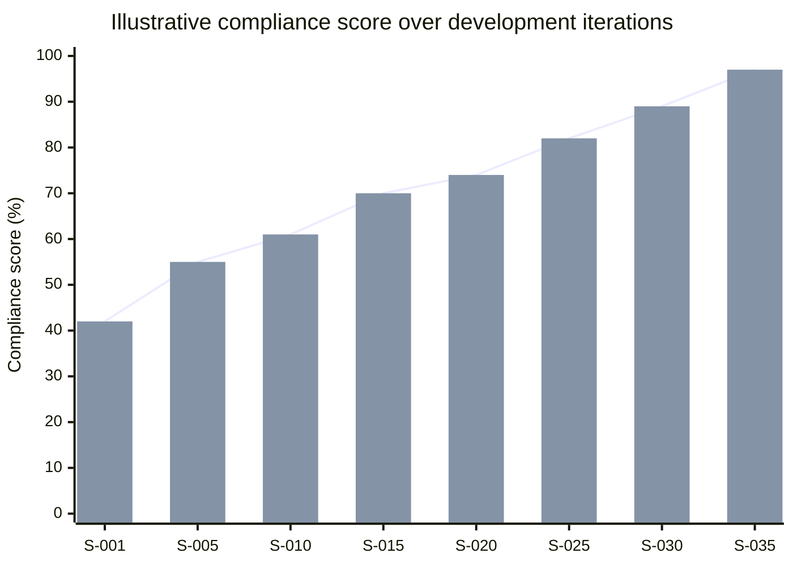
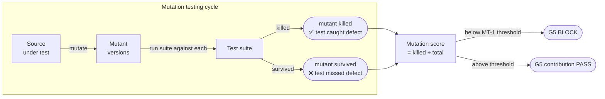

# spec-check

LLMs are powerful but structurally inconsistent. Given the same task twice, a model may produce a thorough specification once and skip it entirely the next time. Without enforcement, spec-driven development becomes aspirational rather than operational — the discipline degrades under time pressure, and codebases accumulate undocumented decisions, untracked bugs, and architecture nobody can explain.

spec-check solves this by acting as a local gatekeeper. An LLM calls it at defined checkpoints, receives a deterministic verdict with specific violations, and must satisfy those violations before the workflow advances. The correction loop is closed autonomously — no human reviewer required at each step.

It runs entirely offline. No code, intent, or metrics leave the machine.

---

## Scientific basis

spec-check can be characterised as **constraint enforcement over a semi-formal logical substrate**. The artifact corpus — stories, PRDs, ADRs, tasks, and tests — constitutes a structured symbolic layer that encodes intent, behavioral contracts, decision rationale, and verification evidence. The gates enforce coherence constraints over this substrate: each layer must satisfy formal properties before the next layer can be constructed or evaluated. The substrate is *semi-formal* because the lower layers (stories, intent) use constrained natural language evaluated by heuristic rules, while the upper layers (task traceability, test coverage) admit fully deterministic predicate evaluation.

### The substrate: stratified artifact layers

Each artifact type occupies a distinct epistemic stratum. Constraints flow downward — lower layers must be satisfied before upper layers are meaningful — and traceability flows upward, binding each implementation artifact to the intent that motivated it.



### Artifact coherence constraints

Traceability requirements form explicit cross-stratum constraints. An ADR that references a nonexistent rule, or a task that cites no rule ID, violates a coherence constraint independently of whether the artifact is otherwise well-formed.



### Gate-based constraint enforcement

The five gates implement a directed acyclic dependency graph over the substrate strata. Each gate is a conjunction of predicate functions; the gate passes only when all predicates evaluate to true. The system enforces monotonic forward progress — a gate cannot pass while any predecessor is blocked.



### Gate state machine

Each gate produces one of four verdicts. PASSING_WITH_WARNINGS allows the workflow to advance while flagging heuristic concerns that do not meet the threshold for a hard block.



### LLM autonomous correction loop

Because every verdict is deterministic and includes specific violations with fix instructions, an LLM can close the correction loop without human intervention. The sequence below is the core interaction pattern.



### Formal vs. heuristic checks

Not all constraints are equally formal. Structural checks (file existence, rule ID citation, test-to-rule mapping) are fully deterministic. Semantic checks (problem precedes solution, causal language density) are heuristic — they score evidence from the text and apply configurable thresholds.



Checks in the upper half produce binary verdicts regardless of confidence. Checks in the lower half produce scored verdicts and block only when the score falls below a configurable threshold, making them tunable without changing the predicate logic.

### Longitudinal compliance tracking

Every gate check writes a Parquet record to a local columnar store (DuckDB). This enables time-series analysis of spec adherence across sessions, models, and projects — treating compliance as a measurable signal rather than a point-in-time audit.



Tracked signals include gate pass rates, cyclomatic complexity trend (max CC vs threshold), mutation score, assumption invalidation rate, and per-model compliance comparisons when multiple LLMs contribute to the same project.

### Mutation testing: coverage vs. adequacy

The `check_mutation_score` tool integrates with language-specific mutation frameworks (Stryker, mutmut, cargo-mutants, go-mutesting) to measure test suite *adequacy* — the fraction of artificially introduced defects that the test suite detects. This is distinct from line coverage, which measures only which code paths are executed, not whether the assertions are strong enough to catch mutations of those paths.



---

## How it works

Projects maintain spec artifacts across several directories. Each gate checks one layer:

| Artifact | Gate | Purpose |
|---|---|---|
| `stories/` | G1 | One file per feature — intent, acceptance criteria, assumptions |
| `prd/` | G2 | Feature → Rule → Example specs (compiled into `requirements.md`) |
| `adr/` | G3 | Architecture decision records with requirement traceability |
| `tasks.md` | G4 | Atomic implementation tasks, each citing a rule ID |
| `tests/` | G5 | Executable test coverage |
| `rca/` | — | Root cause analyses for incidents and assumption failures |
| `intent.md` | G1 | Project-level problem statement, goals, and constraints |
| `requirements.md` | G2 | Compiled output of `prd/` files — do not edit directly |

The runtime exposes the same tool catalog through MCP and the local JSON API. The primary workflow is:

```
run_all               → run all five gates, stop at first BLOCK
gate_check            → targeted recheck of a single gate (gate: "G1"…"G5")
validate_artifact     → validate a single story, ADR, or RCA file
compile_requirements  → merge prd/*.md into requirements.md
diff_check            → analyse git diff, identify which gates need re-running
complexity            → CC, cognitive complexity, nesting, function length
check_mutation_score  → mutation testing with trend detection
metrics               → query stored compliance history for a project
get_rollup            → cross-project rankings and model comparisons
```

Each tool returns structured JSON with `data`, `meta`, and `workflow`, with per-check `status`, `criteria`, `evidence`, and `fix` instructions inside the tool payload.

---

## Installation

**Requirements:** Node.js 18+, git

**Homebrew (macOS):**

```bash
brew tap cablepull/spec-check
brew install spec-check
```

After install, brew prints setup instructions. To configure your LLM tool:

```bash
spec-check init --tool claude --path .   # Claude Code
spec-check init --tool cursor --path .   # Cursor
spec-check init --tool gemini --path .   # Gemini CLI
spec-check init --tool codex  --path .   # OpenAI Codex
spec-check init --tool ollama --path .   # Ollama
spec-check init --all         --path .   # all detected tools
```

Use `--force` to overwrite existing config files, `--install` to install missing dependencies.

**npm:**

```bash
npm install -g spec-check   # or: npx spec-check
```

## Runtime modes

### MCP server (default)

Running `spec-check` with no arguments starts the MCP stdio server. This is what LLM tools connect to — Claude Code, Cursor, and any other MCP-compatible client send tool calls over stdin/stdout and receive structured JSON responses.

```bash
spec-check          # starts MCP stdio server
npx spec-check      # same, without global install
```

Register it in your LLM tool's MCP config (see [Add to your MCP client](#add-to-your-mcp-client) below), or run `spec-check init --tool <name>` to have it written automatically.

### Local daemon

The daemon starts an HTTP API and dashboard on `127.0.0.1:4319`. Use this when you want to call spec-check from scripts, CI, or a browser dashboard rather than through an LLM tool.

```bash
spec-check server           # start daemon + dashboard
spec-check server --port=4321
```

### Onboarding (init)

`spec-check init` writes the integration config files for your LLM tool and prints the MCP server entry to register.

```bash
spec-check init --tool claude   # writes CLAUDE.md, prints MCP entry
spec-check init --tool cursor   # writes .cursor/rules/spec-check.mdc
spec-check init --tool gemini   # writes .gemini/GEMINI.md
spec-check init --tool codex    # writes codex.md
spec-check init --tool ollama   # writes .ollama/spec-check.md
spec-check init --all           # all tools detected on this machine
```

Flags: `--path <dir>` (project root, default `.`), `--force` (overwrite existing files), `--install` (install missing dependencies).

**Optional dependencies** (detected automatically, install as needed):

| Tool | Enables |
|---|---|
| `lizard` (Python) | Cognitive complexity, nesting depth for all languages |
| `stryker` | Mutation testing for TypeScript/JavaScript |
| `mutmut` | Mutation testing for Python |
| `go-mutesting` | Mutation testing for Go |
| `cargo-mutants` | Mutation testing for Rust |

Check what's available: call the `check_dependencies` tool.

---

## Add to your MCP client

**Claude Desktop** (`~/Library/Application Support/Claude/claude_desktop_config.json`):

If installed via brew or `npm install -g`:
```json
{
  "mcpServers": {
    "spec-check": {
      "command": "spec-check",
      "args": []
    }
  }
}
```

If using npx (no global install):
```json
{
  "mcpServers": {
    "spec-check": {
      "command": "npx",
      "args": ["-y", "spec-check"]
    }
  }
}
```

Run `spec-check init --tool claude --path .` to have this written to the right location automatically.

**Cursor / other MCP clients:** same `command` + `args`, placed in the client's MCP server config. Or run `spec-check init --tool cursor --path .`.

## Local HTTP API

When the daemon is running, the local API exposes:

- `GET /health`
- `GET /api/tools`
- `GET /api/projects`
- `POST /api/projects`
- `POST /api/tools/call`
- `GET /api/project`
- `GET /api/rollup`
- `GET /api/assumptions`
- `GET /api/dependencies`

Example:

```bash
curl -s http://127.0.0.1:4319/api/tools
```

Register a project:

```bash
curl -s -X POST http://127.0.0.1:4319/api/projects \
  -H 'content-type: application/json' \
  --data '{"path":".","name":"spec-check"}'
```

Call a tool over HTTP:

```bash
curl -s -X POST http://127.0.0.1:4319/api/tools/call \
  -H 'content-type: application/json' \
  --data '{
    "tool":"run_all",
    "project_id":"spec-check",
    "arguments":{"format":"json"},
    "actor":{"provider":"openai","model":"gpt-5.4","agent_id":"agent-1","session_id":"session-1"}
  }'
```

---

## The five gates

| Gate | Name | Checks | Blocks on |
|---|---|---|---|
| G1 | Stories Valid | `stories/` | Missing intent, acceptance criteria, or constraint language |
| G2 | PRD Valid | `prd/` | Feature/Rule/Example structure, missing negative examples |
| G3 | ADR Valid | `adr/` | Missing sections, stale requirement traceability |
| G4 | Tasks Valid | `tasks.md` | Compound tasks, tasks missing rule references |
| G5 | Executability Valid | `tests/` | No test files, rules with no test coverage |

`run_all` stops at the first BLOCKED gate and returns next-step instructions. Gates that pass continue.

---

## Configuration

Place `spec-check.config.json` in the project root (all fields optional):

```json
{
  "thresholds": {
    "CC-1": 10,
    "MT-1": 80,
    "MT-2": 90
  },
  "compliance_weights": {
    "G1": 0.15,
    "G2": 0.30,
    "G3": 0.20,
    "G4": 0.15,
    "G5": 0.20
  },
  "metrics": {
    "db_path": "~/.spec-check/data",
    "retention_days": 365
  },
  "mutation": {
    "enabled": true,
    "incremental": true,
    "triggers": {
      "default": "pre_merge"
    }
  }
}
```

**Key thresholds:**

| ID | What it controls | Default |
|---|---|---|
| `CC-1` | Max cyclomatic complexity per function | 10 |
| `CC-3` | Max average CC per file | 5 |
| `CC-4` | Max nesting depth | 4 |
| `MT-1` | Project mutation score floor (%) | 80 |
| `MT-2` | Spec-critical function mutation floor (%) | 90 |

---

## Metrics and dashboard

Every tool call writes a Parquet record to `~/.spec-check/data` (or the configured `db_path`). Queried by DuckDB; no external database required.

**Per-project metrics** (`metrics` tool): gate pass rates, compliance score, cyclomatic complexity history (max CC + violations per run), mutation trend, assumption invalidation rate, lifecycle measurements.

**Cross-project rollup** (`get_rollup` tool): compliance rankings, model and agent comparisons, top projects by max CC, common violations.

**HTML dashboard** (served by `spec-check server`): renders charts for gate pass rate history, CC trend (max CC vs CC-1 threshold), mutation score, and the heatmap showing pass/fail across all five gates per run iteration.

## Multi-project usage

The daemon can register multiple local repositories and route tool calls by stable project identifier instead of raw path. When multiple projects are registered, callers should send `project_id` or `path` explicitly so the request stays unambiguous.

---

## Workflow guidance

Agents that call `begin_session` receive `WorkflowGuidance` after every tool call:

```json
{
  "phase": "implementation",
  "must_call_next": ["run_all"],
  "should_call_metrics": false,
  "must_report_state": true,
  "blocked": false,
  "blocked_by": []
}
```

`must_call_next` always resolves to `run_all` after a passing individual gate check (not `gate_check:G2 → gate_check:G3` chains), so agents run full sweeps rather than piecemeal checks.

---

## Monorepo support

Automatically detects services by scanning for `package.json`, `go.mod`, `requirements.txt`, `Cargo.toml`, and `pom.xml` up to two directory levels deep. Each detected service is checked independently. Configure with `monorepo.strategy: "auto" | "explicit"`.

---

## Development

```bash
npm install
npm run build   # tsc
npm test        # vitest
```

All source is TypeScript in `src/`. Compiled output goes to `dist/`. The server speaks the MCP stdio transport protocol.
